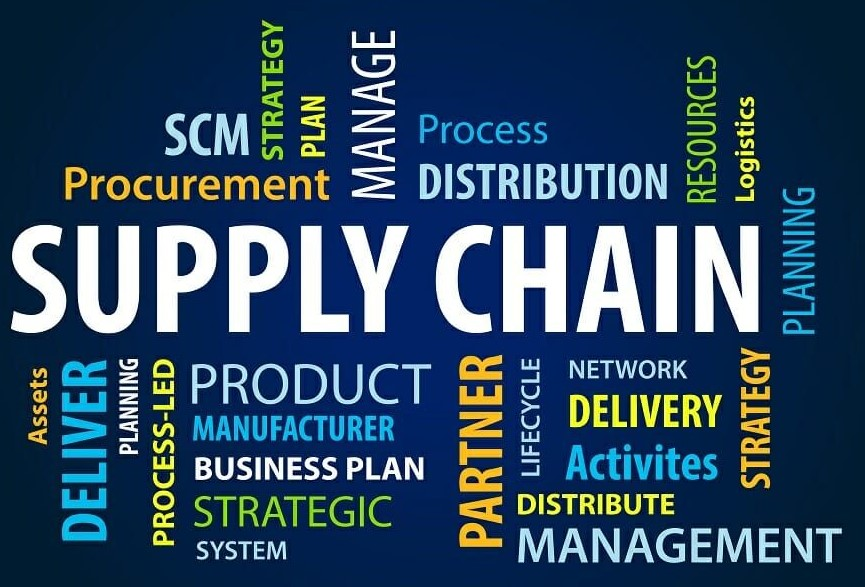
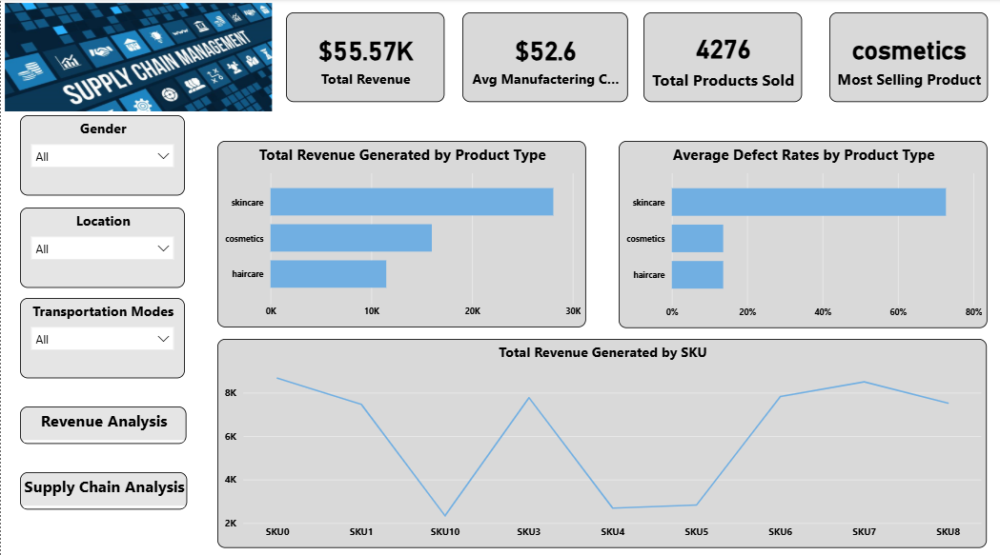
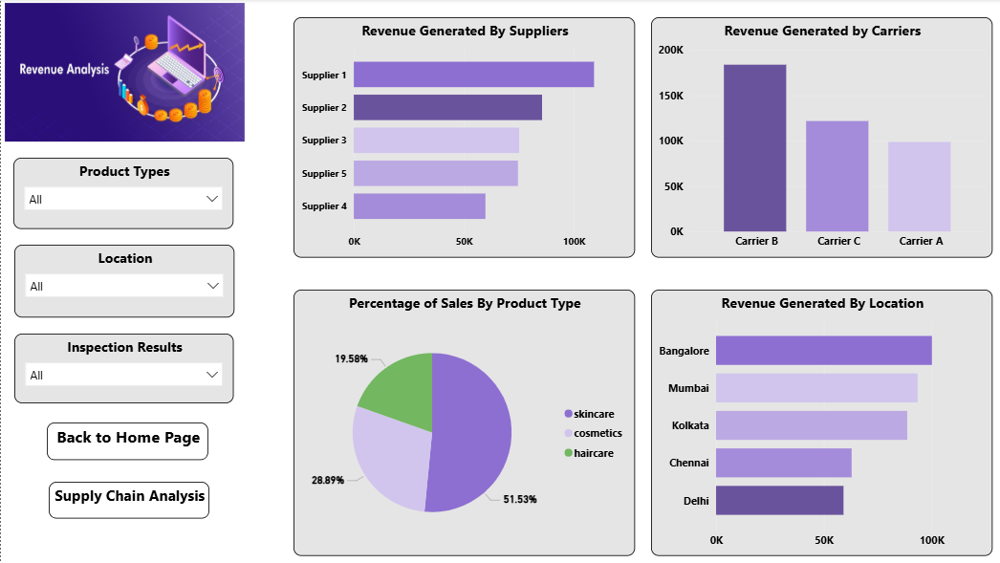

# 🏭 Supply Chain Analytics Dashboard



## 📘 Overview

This project focuses on **analyzing and visualizing supply chain data** for a fashion and makeup product company.  
It demonstrates how to design a complete **data analytics pipeline** — from **ETL (Extract, Transform, Load)** in Python, to **data warehousing in Snowflake**, and finally to **data visualization in Power BI**.

The goal is to uncover actionable insights into product performance, customer behavior, supplier efficiency, and logistics operations.

---

## 📊 Dataset Overview

The dataset includes multiple features related to the supply chain process, covering:

| Category | Features |
|-----------|-----------|
| **Product Information** | Product Type, SKU, Price, Availability |
| **Sales & Revenue** | Number of Products Sold, Revenue Generated |
| **Customer Data** | Demographics (age, gender, location) |
| **Inventory** | Stock Levels, Lead Times, Order Quantities |
| **Shipping** | Shipping Time, Carrier, Cost |
| **Supplier** | Supplier Name, Location |
| **Manufacturing** | Production Volumes, Lead Time, Manufacturing Costs |
| **Quality & Logistics** | Inspection Results, Defect Rates, Transportation Modes, Routes, Costs |

---

## ⚙️ Project Workflow

### 🔹 Step 1: Extract, Transform, and Load (ETL)

- **Data Extraction:** Import supply chain data from sources such as CSV or Excel files.  
- **Data Cleaning & Transformation:** Use Python to clean, standardize, and prepare data for analysis.  
- **Integration:** Merge multiple data sources into one cohesive dataset.  
- **Loading to Snowflake:** Upload the transformed dataset into **Snowflake** for scalable storage and querying.

### 🔹 Step 2: Data Visualization in Power BI

- **Data Connection:** Link Power BI directly to Snowflake.  
- **Dashboard Creation:** Build an **interactive Power BI dashboard** that visualizes key metrics and KPIs (e.g., OTIF rate, supplier performance, lead times).  
- **Insight Generation:** Enable stakeholders to explore data trends, detect inefficiencies, and make data-driven decisions.

---

## 🧱 Project Structure

```

Supply-Chain-Analytics/
│
├── README.md
├── data/
│   ├── raw/
│   │   └── supply_chain_data.xlsx
│   └── processed/
│       └── processed_data.csv
│
├── src/
│   ├── ETL.py
│   └── snowflake_utils.py
│
├── power_bi/
│   └── supply_chain_dashboard.pbix
│
└── imgs/

```

---

## 🚀 Getting Started

1. **Clone the repository**

   ```bash
   git clone https://github.com/drisskhattabi6/Supply-Chain-Analytics.git
   cd Supply-Chain-Analytics
    ```

2. **Install dependencies**

   ```bash
   pip install -r requirements.txt
   ```

3. **Run the ETL script**

   ```bash
   python src/ETL.py
   ```

4. **Load data into Snowflake** using the provided credentials.
5. **Open Power BI** and connect to Snowflake to explore the dashboard.

---

## 📸 Dashboard Screenshots





---

## Conclusion

This project illustrates how a modern data pipeline can be built to handle and analyze supply chain data efficiently.
By combining **Python ETL**, **Snowflake**, and **Power BI**, it provides a scalable and interactive solution for real-time decision-making and performance optimization across the supply chain.

